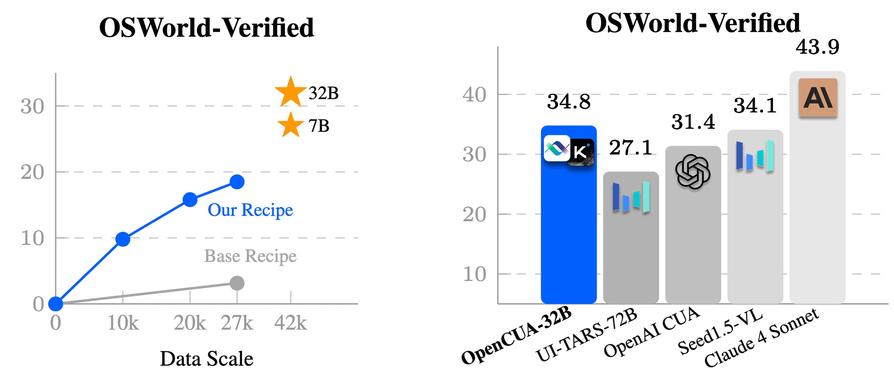

<h1 style="
  font-family:-apple-system,BlinkMacSystemFont,'Segoe UI',Helvetica,Arial,sans-serif;
  font-size:48px;
  font-weight:700;
  line-height:1.25;
  text-align:center;
  margin:0 0 24px;">
  OpenCUA: Open Foundations for Computer-Use Agents
</h1>

<p align="center">
&nbsp&nbsp🌐 <a href="https://opencua.xlang.ai/">Website</a>&nbsp&nbsp | &nbsp&nbsp📑 <a href="https://github.com/XinyuanWangCS/OpenCUA-Website/blob/main/static/pdf/OpenCUA_arxiv.pdf">Paper</a>&nbsp&nbsp | &nbsp&nbsp🤗 <a href="https://huggingface.co/datasets/xlangai/AgentNet">Dataset</a>&nbsp&nbsp | &nbsp&nbsp🤖 <a href="https://huggingface.co/collections/xlangai/opencua-open-foundations-for-computer-use-agents-6882014ebecdbbe46074a68d">Model</a>&nbsp&nbsp | &nbsp&nbsp🔧  <a href="https://agentnet-tool.xlang.ai/">Tool</a>&nbsp&nbsp | &nbsp&nbsp🎮  <a href="https://huggingface.co/spaces/xlangai/OpenCUA-demo">Model Demo</a>&nbsp&nbsp 
</p>

<div align="center">
  
</div>

<div style="max-width:900px;margin:0 auto;">


# Introduction
<div style="
  max-width: 880px;              /* 可按需调节整体宽度 */
  margin: 0 auto;               /* 居中容器 */
  text-align: justify;          /* 关键：两端对齐 */
  text-justify: inter-word;     /* 优化英文对齐效果 */
  line-height: 1.6;">
  
<b>OpenCUA</b> is a comprehensive open-source framework for scaling CUA data and foundation models, consisting of: 
- <b>[AgentNet](https://huggingface.co/datasets/xlangai/AgentNet)</b>: the first large-scale computer-use task dataset spanning 3 operating systems and 200+ applications and websites; 
- **[AgentNetTool](https://agentnet-tool.xlang.ai/)**: an annotation infrastructure that seamlessly captures human computer-use demonstrations; 
- <b>[AgentNetBench](https://github.com/xlang-ai/OpenCUA/tree/main/AgentNetBench)</b>: an offline evaluator that benchmarks model-predicted low-level actions against ground-truth trajectories.
- **[OpenCUA Models](https://huggingface.co/collections/xlangai/opencua-open-foundations-for-computer-use-agents-6882014ebecdbbe46074a68d")**: end-to-end computer-use foundation models than can produce executable actions in the computer environments with great planning and grounding capabilities.


With the help of OpenCUA framework, our end-to-end agent models demonstrate strong performance across CUA benchmarks. In particular, <b>OpenCUA-32B</b> achieves an average success rate of **34.8%** on [OSWorld-Verified](https://os-world.github.io/), 
establishing a new state-of-the-art (SOTA) among open-source models. 

</div>

# AgentNetTool – Annotation & Verification Tool
Our **AgentNetTool** is a cross-platform GUI recorder that runs unobtrusively on annotators’ machines.  
It captures synchronized **screen video**, **mouse/keyboard events**, and **accessibility trees**, then provides an in-browser UI for reviewing, trimming, and submitting demonstrations.  

👉 **[AgentNetTool Document](https://agentnet-tool.xlang.ai/)**

---

# DataProcessor – Action Reduction & State–Action Matching
Raw demonstrations can contain thousands of low-level events that are too dense for model training.  
The **DataProcessor** module (`./DataProcessor/`) performs two key steps:

1. **Action Reduction** — merges granular signals into concise, semantically meaningful PyAutoGUI actions (e.g., collapsing mouse moves → click, coalescing scrolls, grouping key-press sequences into text or hotkeys).  
2. **State–Action Matching** — aligns every reduced action with the *last visually distinct frame* **before** the action begins, avoiding future-information leakage and yielding compact state–action pairs.

These processed trajectories underlie all downstream training and evaluation.

---

# CoTGenerator – Synthesizing Reflective Long Chain-of-Thought Reasoning
To boost robustness and interpretability, we augment each trajectory with **reflective long Chain-of-Thought (CoT) reasoning**.  
The **CoTGenerator** pipeline (`./CoTGenerator/`) synthesizes step-level reflections that:

* reflect on the previous action,
* explain *why* an action is chosen given the current observation and history,  
* note potential alternative actions, and  
* forecast the expected next state.

Empirically, models trained with these rich CoTs scale better with data and generalize across unseen applications.


# AgentNetBench – Offline Evaluation

**AgentNetBench** (`./AgentNetBench/`) provides an offline evaluator for UI interaction trajectories. It compares model-predicted low-level actions (click, moveTo, write, press, scroll, terminate, etc.) against ground-truth actions and reports detailed metrics. See [AgentNetBench/README.md](./AgentNetBench/README.md) for usage instructions.

# Acknowledge
<p>
We thank Su Yu, Caiming Xiong, Binyuan Hui, and the anonymous reviewers for their insightful discussions and valuable feedback. 
We are grateful to Moonshot AI for providing training infrastructure and annotated data. 
We also sincerely appreciate Calvin, Ziwei Chen, Jin Zhang, Ze Li, Zhengtao Wang, Yanxu Chen, and Qizheng Gu from the Kimi Team for their strong infrastructure support and helpful guidance. 
The development of our tool is based on the open-source projects-<a href="https://github.com/TheDuckAI/DuckTrack" target="_blank">DuckTrack</a> and <a href="https://github.com/OpenAdaptAI/OpenAdapt" target="_blank">OpenAdapt</a>. 
We are very grateful to their commitment to the open source community. Finally, we extend our deepest thanks to all annotators for their tremendous effort and contributions to this project.
</p>

# License

This project is licensed under the MIT License - see the LICENSE file for details.

## Research Use and Disclaimer

OpenCUA is intended for **research and educational purposes only**. 

### Prohibited Uses
- The model, dataset, tool, and code may **not** be used for any purpose or activity that violates applicable laws or regulations in any jurisdiction
- Use for illegal, unethical, or harmful activities is strictly prohibited

### Disclaimer
- The authors, contributors, and copyright holders are **not responsible** for any illegal, unethical, or harmful use of the Software, nor for any direct or indirect damages resulting from such use
- Use of the "OpenCUA" name, logo, or trademarks does **not** imply any endorsement or affiliation unless separate written permission is obtained
- Users are solely responsible for ensuring their use complies with applicable laws and regulations

## Citation

If you use OpenCUA in your research, please cite our work:

```bibtex
@article{OpenCUA2025, 
  title={OpenCUA: Open Foundations for Computer-Use Agents}, 
  author={Wang, Xinyuan and Wang, Bowen and Lu, Dunjie and Yang, Junlin and Xie, Tianbao and Wang, Junli and Deng, Jiaqi and Guo, Xiaole and Xu, Yiheng and Wu, Chen Henry and Shen, Zhennan and Li, Zhuokai and Li, Ryan and Li, Xiaochuan and Chen, Junda and Zheng, Boyuan and Li, Peihang and Lei, Fangyu and Cao, Ruisheng and Fu, Yeqiao and Shin, Dongchan and Shin, Martin and Hu, Jiarui and Wang, Yuyan and Chen, Jixuan and Ye, Yuxiao and Zhang, Danyang and Wang, Yipu and Wang, Heng and Yang, Diyi and Zhong, Victor and Charles, Y. and Yang, Zhilin and Yu, Tao}, 
  year={2025}, 
  url={https://opencua.xlang.ai/} 
}
```


</div>
