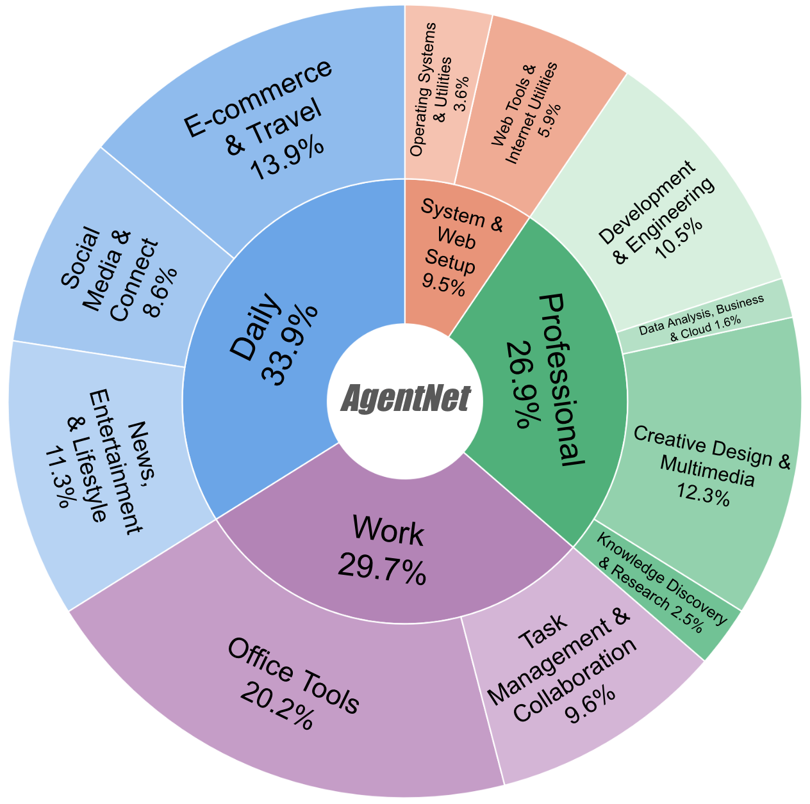

# AgentNet Dataset - Large-Scale Computer-Use Dataset

<div align="center">
  
</div>

AgentNet is the first large-scale desktop computer-use agent trajectory dataset, containing 22.6K human-annotated computer-use tasks across Windows, macOS, and Ubuntu systems. 

👉 **[AgentNet Huggingface Dataset](https://huggingface.co/datasets/xlangai/AgentNet)**

Download the dataset here：
```
pip install -U huggingface_hub
huggingface-cli download xlangai/AgentNet --repo-type dataset --local-dir ./AgentNet
```

Collecting computer-use agent training data requires 3 steps:
- Demonstrate human computer-use task via [AgentNetTool](https://agentnet-tool.xlang.ai/);
- Preprocess the demonstration using [Action Reduction & State-Action Matching](./data/data-processor);
- For each step, [synthesize reflective long CoT](./data/cot-generator)


## 1 AgentNetTool – Annotation & Verification Tool
<div align="center">
  
</div>


Our **AgentNetTool** is a cross-platform GUI recorder that runs unobtrusively on annotators’ machines. It captures synchronized **screen video**, **mouse/keyboard events**, and **accessibility trees**, then provides an in-browser UI for reviewing, trimming, and submitting demonstrations. AgentNet Tool is available on Windows, macOS and Ubuntu. 

👉 **[AgentNetTool Document](https://agentnet-tool.xlang.ai/)**


## 2 DataProcessor – Action Reduction & State–Action Matching
Raw demonstrations can contain thousands of low-level events that are too dense for model training.  
The **DataProcessor** module (`./data/data-process/`) performs two key steps:

1. **Action Reduction** — merges granular signals into concise, semantically meaningful PyAutoGUI actions (e.g., collapsing mouse moves → click, coalescing scrolls, grouping key-press sequences into text or hotkeys).  
2. **State–Action Matching** — aligns every reduced action with the *last visually distinct frame* **before** the action begins, avoiding future-information leakage and yielding compact state–action pairs.

These processed trajectories underlie all downstream training and evaluation.

---

## 3 CoTGenerator – Synthesizing Reflective Long Chain-of-Thought Inner Monologue
To boost robustness and interpretability, we augment each trajectory with **reflective long Chain-of-Thought (CoT) reasoning**.  
The **CoTGenerator** pipeline (`./data/cot-generator/`) synthesizes step-level reflections that:

* reflect on the previous action,
* explain *why* an action is chosen given the current observation and history,  
* note potential alternative actions, and  
* forecast the expected next state.

Empirically, models trained with these rich CoTs scale better with data and generalize across unseen applications.
